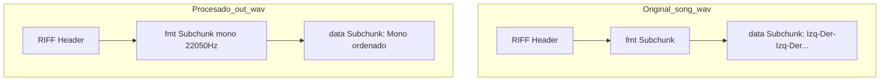
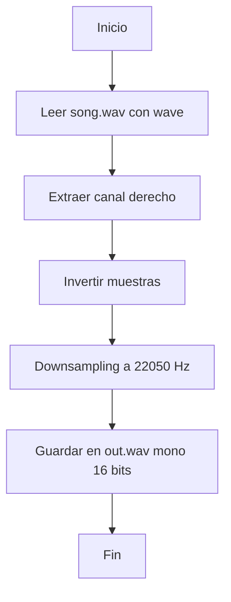

# Proyecto 1 - Procesamiento de Audio WAV

Este proyecto consiste en procesar un archivo de audio WAV estéreo, extraer el canal derecho (que contiene una canción invertida), reconstruir el orden original, reducir la frecuencia de muestreo y guardar el resultado en un archivo mono. Todo el procesamiento se realiza únicamente con el módulo estándar `wave` de Python.

---

## Índice
1. [Descripción del problema](#descripción-del-problema)
2. [Estructura del proyecto](#estructura-del-proyecto)
3. [Explicación detallada del procesamiento](#explicación-detallada-del-procesamiento)
4. [Diagramas del flujo y estructura](#diagramas-del-flujo-y-estructura)
5. [Instrucciones de uso](#instrucciones-de-uso)
6. [Procesamiento manual en Audacity](#procesamiento-manual-en-audacity)
7. [Requerimientos y observaciones](#requerimientos-y-observaciones)

---

## Descripción del problema

El archivo de entrada `song.wav` es un archivo estéreo (2 canales) de 16 bits y 44.1kHz. El canal izquierdo contiene ruido blanco y el canal derecho contiene una canción, pero en sentido inverso (invertida). El objetivo es:

- Procesar solo el canal derecho.
- Reconstruir el orden original de la canción (pues está invertida).
- Generar un archivo `out.wav` en formato mono, 16 bits, 22.05kHz.
- Visualizar y reproducir el resultado en Audacity.
- Usar únicamente el módulo estándar `wave` de Python.

---

## Estructura del proyecto

- `main.py`: Script principal con el procesamiento y comentarios detallados.
- `song.wav`: Archivo de entrada (estéreo, 16 bits, 44.1kHz).
- `out.wav`: Archivo de salida (mono, 16 bits, 22.05kHz).
- `Proyecto 1 Información.md`: Documentación extendida y enunciado.
- `P#1 INFO1155_1_2.pdf`: Documento de referencia.
- `README.md`: Este archivo.

---

## ¿Qué es un archivo WAV?

Un archivo WAV (Waveform Audio File Format) es un formato de audio digital sin compresión basado en el estándar RIFF. Su estructura básica incluye una cabecera (header) y los datos de audio (data). La cabecera contiene información esencial para que los reproductores puedan interpretar correctamente el archivo, como el número de canales, la frecuencia de muestreo y los bits por muestra. Los datos de audio se almacenan en bloques llamados subchunks, siendo los más importantes:

- **Cabecera RIFF:** Identifica el archivo como tipo WAV y contiene el tamaño total del archivo.
- **Subchunk "fmt ":** Describe el formato del audio (PCM, número de canales, frecuencia de muestreo, bits por muestra, etc).
- **Subchunk "data":** Contiene los datos de audio propiamente dichos.

Referencia: [Formato WAV explicado](http://soundfile.sapp.org/doc/WaveFormat/)

---

## Explicación detallada del procesamiento

### 1. Lectura del archivo WAV

Para comenzar, se utiliza el módulo estándar `wave` de Python para abrir el archivo `song.wav` en modo lectura binaria. Esto permite acceder a la cabecera del archivo y obtener información relevante sin cargar todo el archivo en memoria.

```python
import wave

archivo_entrada = 'song.wav'
with wave.open(archivo_entrada, 'rb') as wav_in:
    num_canales = wav_in.getnchannels()  # Número de canales (debe ser 2)
    frecuencia_muestreo = wav_in.getframerate()  # Frecuencia de muestreo (debe ser 44100 Hz)
    num_muestras = wav_in.getnframes()  # Número total de frames
    sample_width = wav_in.getsampwidth()  # Tamaño de muestra (debe ser 2 bytes)
    frames = wav_in.readframes(num_muestras)  # Leer todos los frames
```

- **¿Qué ocurre aquí?**
  - Se abre el archivo y se leen sus propiedades principales: número de canales, frecuencia de muestreo, cantidad de muestras y tamaño de cada muestra.
  - Cada frame contiene una muestra de cada canal (4 bytes por frame: 2 bytes para el canal izquierdo y 2 bytes para el derecho).
  - `frames` es un bloque de bytes que contiene todos los datos de audio del archivo.
  - **Estructura WAV modificada:** En este paso solo se lee la cabecera y los datos, sin modificar el archivo.

---

### 2. Extracción del canal derecho

El siguiente paso es extraer solo el canal derecho de cada frame. Esto se hace recorriendo el bloque de datos y tomando los bytes correspondientes al canal derecho.

```python
canal_derecho = bytearray()
for i in range(0, len(frames), 4):
    canal_derecho += frames[i+2:i+4]  # Tomar los 2 bytes del canal derecho
```

- **¿Qué ocurre aquí?**
  - Se recorre el bloque de datos de 4 en 4 bytes (cada 4 bytes es un frame).
  - De cada frame, se extraen los bytes 2 y 3 (índices 2 y 3), que corresponden al canal derecho.
  - Se van concatenando en un nuevo bloque de bytes llamado `canal_derecho`, que contendrá solo las muestras del canal derecho, en el mismo orden en que estaban en el archivo original (es decir, invertidas respecto a la canción real).
  - **Estructura WAV modificada:** En este paso, en memoria, se prepara el bloque de datos que reemplazará el subchunk "data" en el archivo de salida.

---

### 3. Inversión del canal derecho

El canal derecho está almacenado al revés, por lo que es necesario invertir el orden de las muestras para reconstruir la canción correctamente.

```python
muestras = [canal_derecho[i:i+2] for i in range(0, len(canal_derecho), 2)]
muestras_invertidas = muestras[::-1]
```

- **¿Qué ocurre aquí?**
  - Se divide el bloque de bytes en fragmentos de 2 bytes, cada uno representando una muestra de audio (16 bits).
  - Se invierte la lista de muestras usando slicing (`[::-1]`), de modo que la primera muestra pasa a ser la última y viceversa.
  - Ahora, la canción está en el orden correcto en memoria.
  - **Estructura WAV modificada:** El bloque de datos que se escribirá en el subchunk "data" del archivo de salida ya está en el orden correcto.

---

### 4. Downsampling (reducción de frecuencia)

El archivo original tiene una frecuencia de 44100 Hz, pero se requiere que el archivo de salida tenga 22050 Hz. Para lograr esto, se toma una de cada dos muestras de la lista invertida.

```python
muestras_downsampled = muestras_invertidas[::2]
```

- **¿Qué ocurre aquí?**
  - Se selecciona una de cada dos muestras, lo que reduce la cantidad de datos a la mitad y, por lo tanto, la frecuencia de muestreo a 22050 Hz.
  - Esto es suficiente para que la canción suene correctamente, aunque con una calidad ligeramente menor.
  - **Estructura WAV modificada:** El tamaño del subchunk "data" y el campo de frecuencia de muestreo en la cabecera serán actualizados en el archivo de salida.

---

### 5. Escritura del archivo de salida y modificación de la estructura WAV en memoria

Finalmente, se unen todas las muestras seleccionadas y se escriben en un nuevo archivo WAV con las propiedades requeridas. Aquí es donde se modifican partes clave de la estructura del archivo WAV en memoria antes de ser escritas en disco:

```python
datos_salida = b''.join(muestras_downsampled)

with wave.open('out.wav', 'wb') as wav_out:
    wav_out.setnchannels(1)  # Mono
    wav_out.setsampwidth(2)  # 16 bits
    wav_out.setframerate(22050)  # 22050 Hz
    wav_out.writeframes(datos_salida)
```

- **¿Qué ocurre aquí y cómo se modifica la estructura WAV?**
  - **Cabecera RIFF:** Se genera una nueva cabecera RIFF, que indica el tamaño total del archivo y el tipo "WAVE".
  - **Subchunk 'fmt ':** Se actualizan los campos:
    - Número de canales: de 2 (estéreo) a 1 (mono).
    - Frecuencia de muestreo: de 44100 Hz a 22050 Hz.
    - Byte rate y block align: recalculados automáticamente según los nuevos parámetros.
    - Bits por muestra: permanece en 16.
  - **Subchunk 'data':**
    - Se reemplaza completamente el bloque de datos de audio. Ahora contiene solo las muestras procesadas (canal derecho, invertido y con downsampling).
    - El tamaño de este bloque se reduce proporcionalmente.
  - **En memoria:** El módulo wave mantiene una estructura interna con todos estos parámetros antes de escribir el archivo. Al llamar a `writeframes`, se vuelca toda esta información al disco, generando un archivo WAV válido y actualizado.

---

### 6. Visualización y reproducción

El archivo `out.wav` contiene la canción en el orden correcto, en formato mono, 16 bits y 22050 Hz. Puede abrirse en Audacity o cualquier reproductor compatible para escuchar y visualizar la forma de onda.

---

### Resumen visual del flujo en memoria

1. **Archivo original:**  [Canal Izquierdo][Canal Derecho][Canal Izquierdo][Canal Derecho]...
2. **Extracción:**  [Canal Derecho][Canal Derecho][Canal Derecho]...
3. **Inversión:**  [Última muestra][...][Primera muestra]
4. **Downsampling:**  [Última muestra][Antepenúltima][...][Primera muestra]
5. **Archivo de salida:**  [Mono, 16 bits, 22050 Hz]

---

### Explicación ampliada del procesamiento y estructura del archivo WAV

#### Estructura básica de un archivo WAV

- **Cabecera RIFF (Resource Interchange File Format):**
  - Identificador "RIFF" (4 bytes)
  - Tamaño total del archivo menos 8 bytes (4 bytes)
  - Identificador "WAVE" (4 bytes)

- **Subchunk "fmt ":** Describe el formato del audio
  - Identificador "fmt " (4 bytes)
  - Tamaño del subchunk (4 bytes)
  - Formato de audio (2 bytes, 1 = PCM)
  - Número de canales (2 bytes)
  - Frecuencia de muestreo (4 bytes)
  - Byte rate (4 bytes)
  - Block align (2 bytes)
  - Bits por muestra (2 bytes)

- **Subchunk "data":** Contiene los datos de audio
  - Identificador "data" (4 bytes)
  - Tamaño de los datos (4 bytes)
  - Datos de audio (N bytes)

Referencia:  
- [Formato WAV explicado](http://soundfile.sapp.org/doc/WaveFormat/)

---

### Visualización de la estructura antes y después

| Campo                | song.wav (original) | out.wav (procesado) |
|----------------------|--------------------|---------------------|
| Número de canales    | 2 (estéreo)        | 1 (mono)            |
| Frecuencia muestreo  | 44100 Hz           | 22050 Hz            |
| Bits por muestra     | 16                 | 16                  |
| Datos de audio       | Estéreo, invertido | Mono, ordenado      |
| Tamaño de datos      | Grande             | Aproximadamente 1/4 |

---

### Diagrama de bloques de la estructura WAV antes y después



---

### Referencias

- [Formato WAV explicado (soundfile.sapp.org)](http://soundfile.sapp.org/doc/WaveFormat/)
- [Documentación oficial del módulo wave de Python](https://docs.python.org/3/library/wave.html)

---

## Diagramas del flujo y estructura

### Diagrama de flujo del procesamiento



## Instrucciones de uso

1. Coloca `song.wav` y `main.py` en el mismo directorio.
2. Ejecuta el script con:
   ```bash
   python main.py
   ```
3. Se generará `out.wav` listo para reproducir en Audacity u otro reproductor compatible.

---

## Procesamiento manual en Audacity

1. **Abrir el archivo**: Ve a `Archivo > Importar > Audio...` y selecciona `song.wav`.
2. **Separar canales**: Haz clic en la flecha junto al nombre de la pista y selecciona `Dividir pista estéreo a mono`.
3. **Eliminar canal izquierdo**: Elimina la pista que contiene solo ruido blanco (normalmente la superior).
4. **Invertir la pista**: Selecciona toda la pista restante (la del canal derecho), ve a `Efecto > Revertir` para restaurar el orden original.
5. **Reducir la frecuencia de muestreo**: Seleccionas la pista en el orden correcto y luego click derecho en el cuadrado del archivo y `Frecuencia > 22050hz` y eliges 22,05Khz 
6. **Exportar**: Ve a `Archivo > Exportar > Exportar como WAV`, selecciona `Mono` y guarda como `out.wav`.

---

## Detalle del enunciado y requerimientos del proyecto

Este proyecto consiste en trabajar con un archivo de audio en formato WAV, cuyo formato y estructura están documentados en [soundfile.sapp.org/doc/WaveFormat/](http://soundfile.sapp.org/doc/WaveFormat/). La cabecera de un archivo WAV contiene toda la información necesaria para que los reproductores de audio puedan interpretar correctamente el sonido o música almacenada. Es fundamental comprender la estructura de la cabecera y los sub-bloques (subchunks) del archivo WAV para manipularlo correctamente.

El archivo song.wav proporcionado tiene las siguientes características:
- 2 canales (estéreo)
- 16 bits por muestra
- Tasa de muestreo de 44.100 Hz

### Contenido de los canales
- El canal izquierdo contiene ruido blanco.
- El canal derecho contiene una canción, pero está en sentido inverso (invertida).

### Objetivos del proyecto
- Procesar únicamente el canal derecho del archivo song.wav.
- Reconstruir el orden original de la canción (ya que está invertida).
- Generar un archivo out.wav en formato mono, 16 bits y con una tasa de muestreo de 22.050 Hz.
- Visualizar y reproducir el archivo out.wav usando el software Audacity.
- Utilizar únicamente el módulo wave de Python para obtener la información relevante y generar el archivo de salida.

### Observaciones y requisitos de entrega
- El informe debe ser completo, en tamaño carta y anillado.
- El trabajo puede ser individual o en grupo de 2 o 3 personas.
- Defensa obligatoria de todos los integrantes del grupo.
- Fecha de entrega y defensa: Primera semana de mayo.

Para cumplir con estos requerimientos, es necesario investigar y comprender el formato WAV y el funcionamiento del módulo wave de Python, ya que no se permite el uso de librerías externas de sonido.

---
